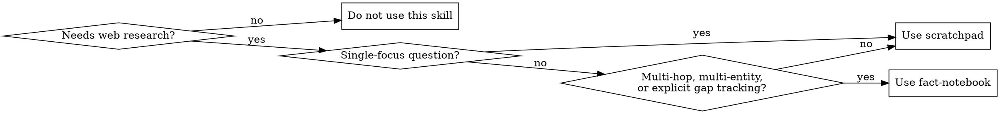

# Bounded Context Research

## Overview

Research without letting context balloon. Keep a compact working state in memory and answer from that state, not from a growing pile of raw search traces.

This skill has two modes:
- `scratchpad` for single-focus questions that likely need only a few searches
- `fact-notebook` for multi-hop, multi-entity, or gap-driven research

## When to Use

Use this skill when:
- the user asks an open-ended factual question that needs web research
- the answer depends on current information, source grounding, or combining facts from multiple places
- you need enough evidence to say "not enough information yet" instead of guessing

Do not use this skill when:
- the task is library or API documentation lookup
- the task is local codebase exploration
- the task is debugging or code review
- the user wants a video summarized
- the answer is already straightforward and does not need research

## Mode Selection

Default to `scratchpad`. Move to `fact-notebook` only when the question clearly needs it.

If a `scratchpad` run turns into multiple entities, conflicting sources, or more open gaps than a short summary can hold cleanly, stop and promote it to `fact-notebook`.

## Scratchpad Mode

Use this for simple or moderately scoped questions where one compact summary can hold the useful knowledge.

Keep this state in memory only:
- original question
- current knowledge summary, capped at one short paragraph or 5-8 bullets
- search history, capped at the last 3-5 queries
- iteration count

Loop:
1. Decide whether you can answer or need one more search.
2. If you need a search, run one focused query.
3. Rewrite the knowledge summary so it keeps only facts that help answer the question.
4. Discard the raw hits from working memory.
5. Repeat until grounded enough to answer or until the remaining uncertainty is itself the answer.

Rules:
- Do not answer before at least one successful search.
- Prefer one sharp query over a kitchen-sink query.
- Each rewrite should deduplicate and compress.
- If the summary starts carrying too many entities or unresolved branches, promote the run to `fact-notebook`.
- If the evidence stays weak, say so plainly.

## Fact-Notebook Mode

Use this when the question requires chaining facts, covering multiple entities, or tracking what is still missing.

Keep this state in memory only:
- research goal
- key elements
- atomic facts with source URLs, capped to the 10-15 facts that matter most
- search queue, capped to the next 3-5 candidate queries
- visited queries, stored as short query labels only

Loop:
1. Rewrite the user ask into a compact research goal. Strip out formatting fluff; keep the actual information need.
2. List the key entities or concepts that must be resolved.
3. Generate a few targeted initial queries.
4. For each query, extract atomic facts from snippets or fetched pages.
5. Deduplicate facts and note the gaps that remain.
6. Stop early if the notebook already covers the goal.
7. Otherwise generate the next queries only for the unresolved gaps.

Rules:
- Facts should be discrete and source-backed.
- Keep only facts that materially advance the goal.
- If the notebook grows past its cap, collapse settled facts into a short synthesis and drop facts you no longer need for the answer or citations.
- Prefer official or primary sources when they exist.
- If sources conflict, say that explicitly instead of smoothing it over.
- Do not turn this into a full research transcript. The notebook is working memory, not the deliverable.

## Shared Rules

- Keep runtime state in memory and keep it small. If a list grows without improving the answer, roll it up or cut it. Do not write temp fact files, manifests, or caches unless the user explicitly asks to save working notes.
- Separate the roles mentally:
  - planner decides the next move
  - extractor or synthesizer compresses evidence
  - finalizer writes the answer
- Answer from compact state plus the supporting sources you trust most, not from raw traces or internal priors.
- Stop as soon as the current state is sufficient.
- When the evidence is incomplete, say what you know, what you do not know, and why.
- When the user asks for brevity, do not dump the search trace.
- The durable artifact is the answer, not the fact units.

## Answer Shape

Default shape:
1. Lead with the answer.
2. Add the minimum supporting facts needed for trust.
3. Include source URLs when they materially help.
4. If something is unresolved, state that directly.

For longer or multi-hop questions, a short bullet list is fine:
- answer
- key supporting facts
- source URLs
- unresolved gaps, if any

## Common Mistakes

- answering from memory because the question looks familiar
- letting raw snippets pile up instead of rewriting the state
- using `fact-notebook` for every question
- summarizing too early and losing the important names, dates, or numbers
- hiding uncertainty when sources are thin or conflicting

## Provenance

This skill is adapted from the bounded-state research patterns in `smhanov/laconic`, but it is written as an agent workflow rather than a Go API guide.
